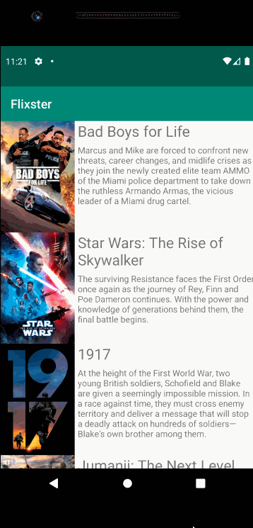

# *Flixster Clone*
**Flixster Clone** is an app that allows users to browse movies from the [The Movie Database API](http://docs.themoviedb.apiary.io/#).

## Features

- [x] User can view a list of movies (title, poster image, and overview) currently playing in theaters from the Movie Database API.
- [x] Views should be responsive for both landscape/portrait mode.
   - [x] In portrait mode, the poster image, title, and movie overview is shown.
   - [x] In landscape mode, the rotated alternate layout should use the backdrop image instead and show the title and movie overview to the right of it.
- [x] Expose details of movie (ratings using RatingBar, popularity, and synopsis) in a separate activity.
- [x] Allow video posts to be played in full-screen using the YouTubePlayerView.

## Open-source libraries used
- [Android Async HTTP](https://github.com/codepath/CPAsyncHttpClient) - Simple asynchronous HTTP requests with JSON parsing
- [Glide](https://github.com/bumptech/glide) - Image loading and caching library for Android

## App Walkthough GIF

 
